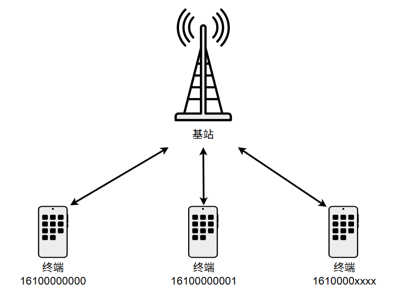
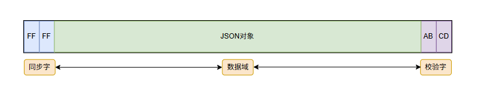
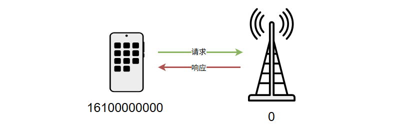
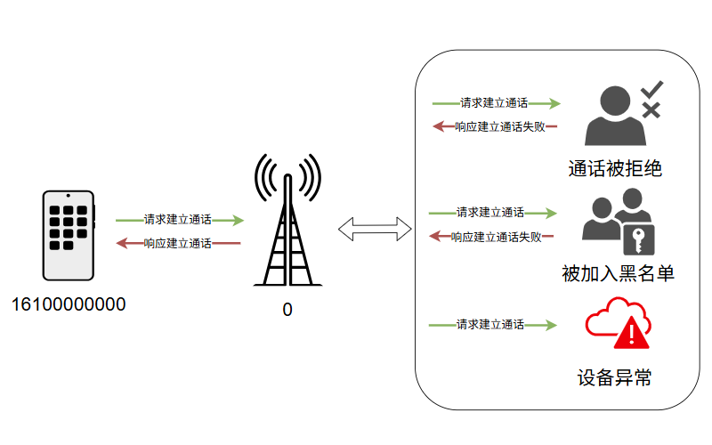
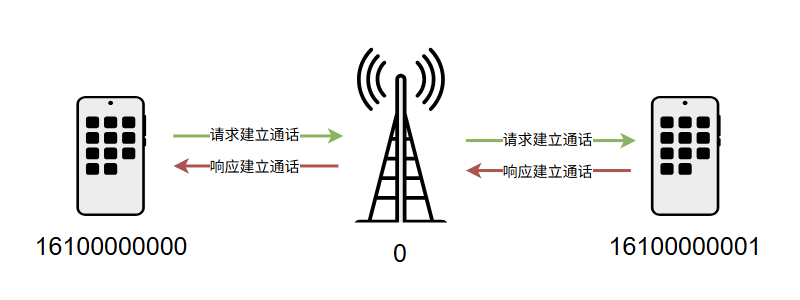
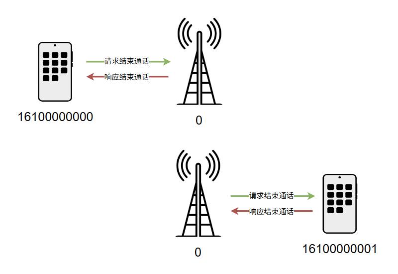
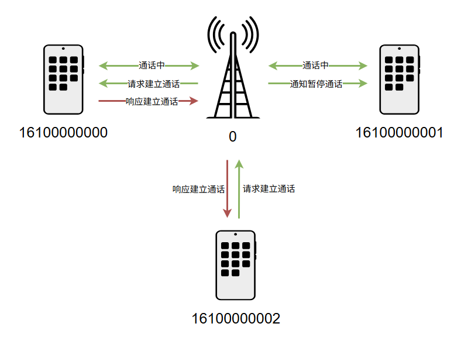
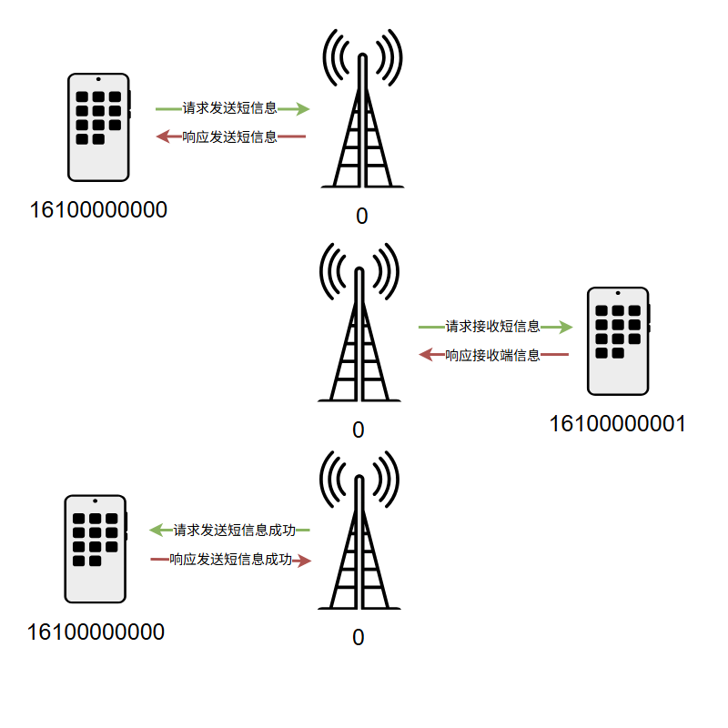
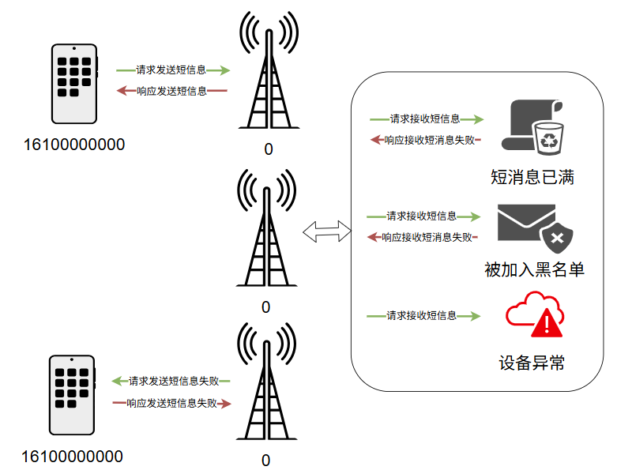

# 功能机模拟基站设计

## 概述

模拟基站（以下简称：基站）主要用来模拟实际蜂窝网络中的终端设备的上线、离线、呼叫转发、短消息转发等基础服务。暂时不包括实际可用的语音通话、网络连接等功能。主要目的是：给JS开发者在开发功能机相关应用时，提供一个相对完整的开发体验。

## 框架



## 设计

### 功能需求

- 实现多端管理，包括多终端端的上线、心跳、离线等管理功能
- 与终端的通信，包括请求响应、数据转发等功能，具体包括：
  - 登录、心跳、离线请求响应
  - 通话请求转发，通话响应转发，通话失败响应
  - 短消息请求转发、短消息响应转发，短消失败响应

### 通信报文



- 报文长度固定为1024字节
- 开头两字节默认为同步字节，结尾两字节默认为CRC校验字节
- 中间1020字节为 JSON 字符串，具体对象如下：

```json
{
    "header": {
        "version": "1.0",
        "id": 0, // 每次请求依次递增，响应返回当前值
        "type": "REQ" | "RSP", // 请求 | 响应
        "timestamp": 1617781300, // 当前时间戳
        "from": 16100000000, // 具体终端
        "to": [16100000001] // 0表示模拟基站，空表示广播，其它表示具体终端
    },
    "payload": {
        "func": "HEART" | "OFFLINE" | "SEND_MESSAGE" | "RECV_MESSAGE" | "MAKE_CALL" | "END_CALL" | "REJECT_CALL",
        "data": {}, // 业务携带的数据内容
        "result": 0 // 业务处理结果
    }
}
```

### 功能场景

#### 终端上线、终端离线、终端心跳

##### 心跳示例



##### 上线、心跳

- 终端每隔3秒发送心跳给基站，基站接收到心跳请求，表示终端上线成功，并给终端返回响应数据
  - 终端接收到了基站的心跳响应，标记为在线状态，状态改变时触发回调通知应用层
  - 终端未接收到基站的心跳响应，标记为离线状态，状态改变时触发回调通知应用层

##### 离线

- 如果终端关闭前处于在线状态（发送的心跳请求有响应），则退出前需要发送离线请求
  - 终端接收到基站的离线响应，正常退出
  - 终端未接收到基站的离线响应，超时退出
- 如果终端关闭前处于离线线状态（发送的心跳请求未接受到响应），则直接退出

##### 报文示例

- 终端请求报文

  ```json
  {
      "header": {
          "version": "1.0",
          "id": 0,
          "type": "REQ",
          "timestamp": 1617781300,
          "from": 16100000000,
          "to": [0]
      },
      "payload": {
          "func": "OFFLINE" | "HEART",
          "data": {}, // 业务携带的数据内容
          "result": 0 // 业务处理结果
      }
  }
  ```

- 模拟基站响应报文

  ```json
  {
      "header": {
            "version": "1.0",
            "id": 0,
            "type": "RSP",
            "timestamp": 1617781310,
            "from": 0,
            "to": [16100000000]
      },
      "payload": {
          "func": "OFFLINE" | "HEART",
          "data": {}, // 业务携带的数据内容
          "result": 0 // 业务处理结果
      }
  }
  ```

#### 通话

##### 建立通话异常



- 终端（16100000000）发送建立通话请求给基站
  - 终端（16100000001）在线，等待终端（16100000001）响应
    - 终端（16100000001）响应超时，返回终端不在服务区响应给终端（16100000000）
    - 终端（16100000001）拒绝通话，返回终端忙响应给终端（16100000000）
  - 终端（16100000001）未登录，返回终端已关机响应给终端（16100000000）
  - 终端（16100000001）已登录，已主动离线，返回终端已关机响应给终端（16100000000）
  - 终端（16100000001）已登录，已心跳超时，返回终端不在服务区响应给终端（16100000000）

##### 建立通话成功



- 终端（16100000000）发送建立通话请求给基站
- 基站转发终端（16100000000）建立通话请求给终端（16100000001），并等待终端（16100000001）的响应

- 基站转发终端（16100000001）响应给终端（16100000000）
  - 终端（16100000000）在线，建立通话
  - 终端（16100000000）已主动离线，返回挂断请求给终端（16100000001）
  - 终端（16100000000）已心跳超时，返回挂断请求给终端（16100000001）

##### 结束通话



- 终端（16100000000）发送结束通话请求给基站
- 基站响应结束通话请求给终端（16100000000）
- 基站发送结束通话请求给终端（16100000001）
- 终端（16100000001）发送结束通话响应给基站

##### 暂停通话



- 终端（16100000000）与终端终端（16100000001）正在通话
- 终端（16100000002）发送建立通话请求给基站
- 基站转发终端（16100000002）建立通话请求给终端（16100000000），并等待终端（16100000000）的响应

- 基站转发终端（16100000000）建立通话响应给终端（16100000002）
  - 终端（16100000002）在线，建立通话
- 基站发送暂停通话的通知给终端（16100000001）

#### 短消息

##### 发送成功



- 终端（16100000000）发送发送短消息请求给基站
- 终端（16100000001）在线
  - 基站发送接收短消息请求给终端（16100000001）
    - 终端（16100000001）发送接收短消息请求给基站

- 基站发送发送短消息成功的请求给终端（16100000000）
- 终端（16100000000）发送发送短消息成功的响应给基站

##### 发送失败



- 终端（16100000000）发送发送短消息请求给基站
- 终端（16100000001）离线、短消息已满无法接收、被加入黑名单拒绝接收等原因
- 基站发送发送短消息失败的请求给终端（16100000000）
- 终端（16100000000）发送发送短消息失败的响应给基站


## 遗留问题

- 短消息接收逻辑，底层接收到短消息后自动存储到存储空间中？还是由应用层存储到存储空间中的？存储空间满了导致接收短消息失败的逻辑是在哪一层实现的？底层直接返回失败？还是由应用层返回失败的？
- 短消息的未读、已读状态是由哪一层控制的？底层？还是应用层？

